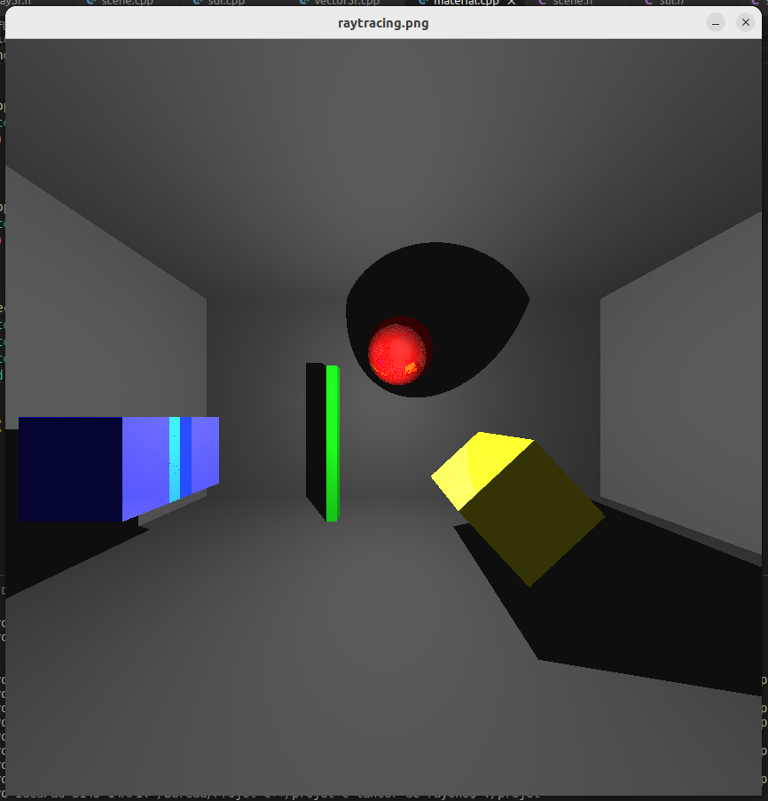
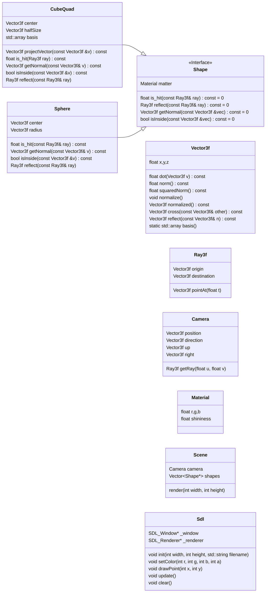

# Projet C++ Lancer de rayons

## Diagramme UML

On présente les diverses classes :

- Vector3f : c’est un vecteur 3D de float.
- Ray3f : un rayon avec une origine et une direction
- Camera : la caméra ou œuil d’où on regarde la scène.
- Material : la couleur (uniforme) et un coefficient de luminosité entre 0 et 1 (0 signifie pas de réflection (objet mat) et 1 signifie que le rayon est entièrement réfléchi (un miroir)).
- Shape : classe abstraite. La méthode is_hit teste si le rayon intersecte l’objet et la méthode reflect renvoie le rayon réfléchi.
- Cube/Quad : un cube ou un rectangle, défini par une origine (le centre) et la taille.
- Sphere : une sphère définie par une origine et un rayon.
- Scene : la scène qui comprend la caméra et les objets et la source de lumière. La méthode render définit la taille de la grille (donc de l’image) ainsi que le nom du fichier dans lequel on sauve l’image.
- Sdl : classe facilitant l'usage de la bibliothèque SDL

Les constructeurs, destructeurs, getters et surcharges d'opérateurs sont omises pour plus de lisibilité.

